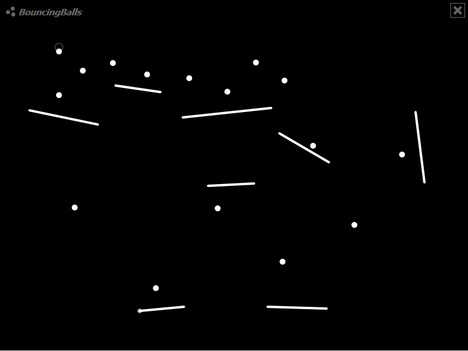
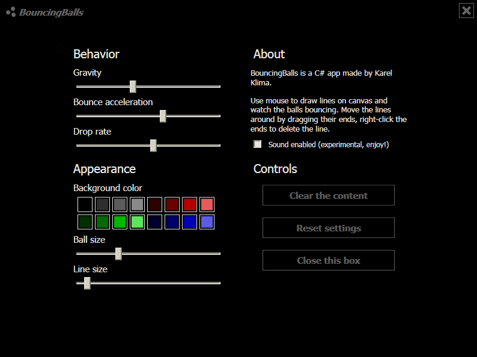

# BouncingBalls

BouncingBalls is mini-game that allows you to bounce balls off lines drawn on a canvas. You begin with an empty canvas, and by using your mouse and performing drag-and-drop actions, you can create as many lines as you desire. To access settings where you can adjust gravity, ball drop rate, bounce, and appearance, simply click on the logo in the top-left corner.

Copyright © 2010-present [Karel Klima](https://karelklima.com)
